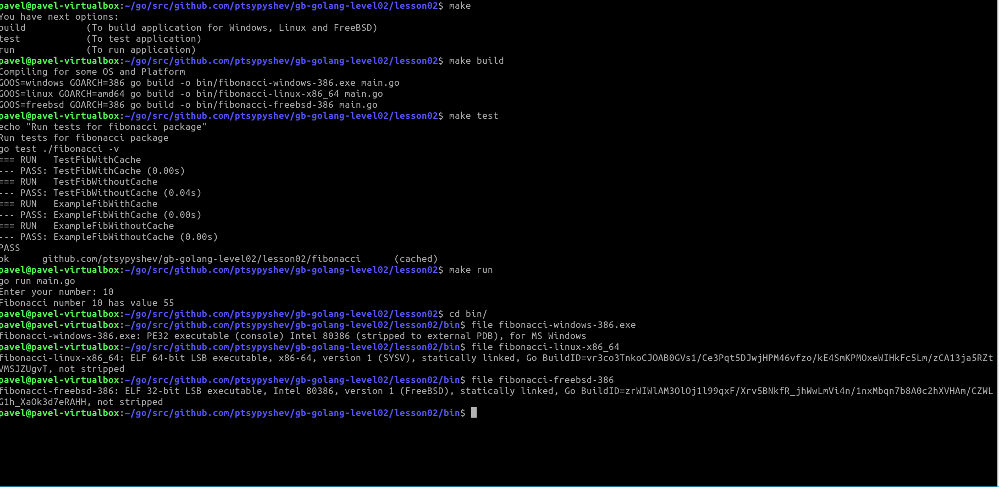
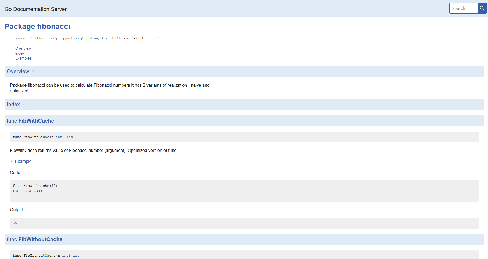

# ДЗ 02
## п. 1 Кроссплатформенная сборка под Linux и Windows (cross-compilation for Linux and Windows)
Для сборки можно использовать команды, с указанием платформы и архитектуры (пример сборки под Windows):  
`GOOS=windows GOARCH=386 go build -o bin/main-windows-386 main.go`  

В проекте приложен Makefile, который работает под Windows и Linux  
Вывод команды `file` для скомпилированных файлов:
`file fibonacci-windows-386.exe`  
`fibonacci-windows-386.exe: PE32 executable (console) Intel 80386 (stripped to external PDB), for MS Windows`  

`file fibonacci-linux-x86_64`  
`fibonacci-linux-x86_64: ELF 64-bit LSB executable, x86-64, version 1 (SYSV), statically linked, Go BuildID=vr3co3TnkoCJOAB0GVs1/Ce3Pqt5DJwjHPM46vfzo/kE4SmKPMOxeWIHkFc5Lm/zCA13ja5RZtVMSJZUgvT, not stripped`  

`file fibonacci-freebsd-386`  
`fibonacci-freebsd-386: ELF 32-bit LSB executable, Intel 80386, version 1 (FreeBSD), statically linked, Go BuildID=zrWIWlAM3OlOj1l99qxF/Xrv5BNkfR_jhWwLmVi4n/1nxMbqn7b8A0c2hXVHAm/CZWLG1h_XaOk3d7eRAHH, not stripped`     

В проекте приложен скриншот (lesson02/screenshots/makefile_screenshot.png)

## п. 2 Документация к пакету (package fibonacci documentation)
Устанавливаем доп. инструмент godoc  
`go get golang.org/x/tools/cmd/godoc`  

Запускаем сервис документации godoc  
`godoc -http=:6060`  

Просмотреть можно по ссылке:  
http://localhost:6060/pkg/github.com/ptsypyshev/gb-golang-level02/lesson02/fibonacci/  
В проекте приложен скриншот (lesson02/screenshots/godoc_screenshot.png)
