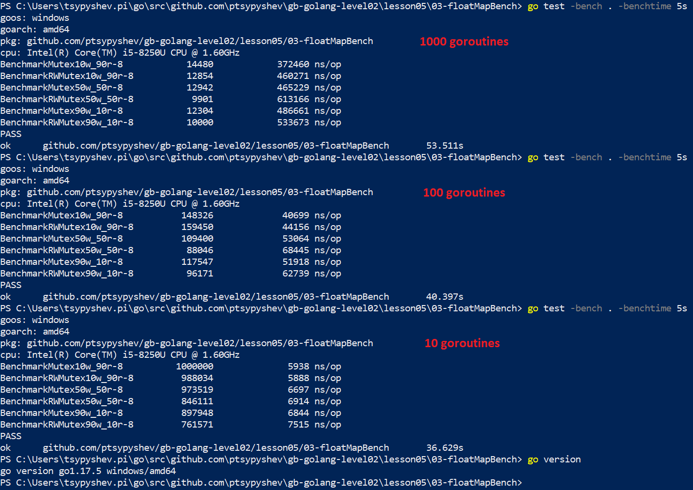
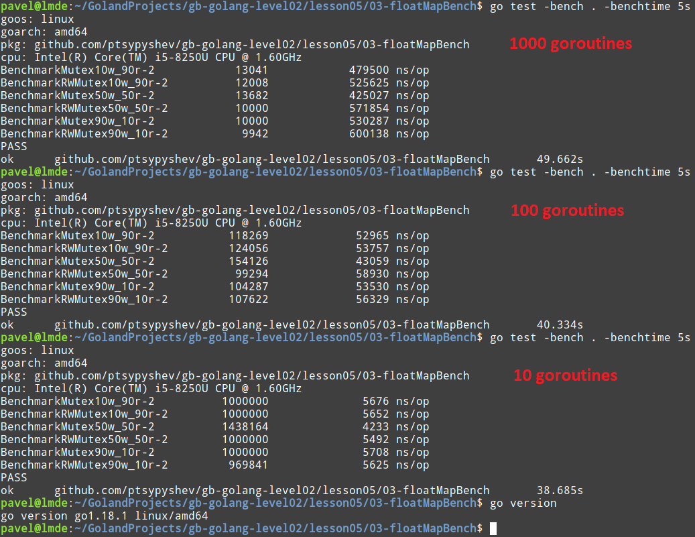

# ДЗ 05

## 1. Напишите программу, которая запускает n потоков и дожидается завершения их всех
Объявляем worker, который эмулирует рандомное время выполнения задачи:  
```golang
func worker(job int, wg *sync.WaitGroup) {
    defer wg.Done()
    rand.Seed(time.Now().UnixNano())
    
    fmt.Printf("Job %d is started.\n", job)
    
    randWorkingTime := time.Duration(rand.Intn(10)) * time.Second
    time.Sleep(randWorkingTime)
    
    fmt.Printf("Job %d is finished, сompleted in %.f seconds.\n", job, randWorkingTime.Seconds())
}
```

Далее в основной программе создаем переменные для количества горутин и waitgroup:
```golang
var (
    n  int
    wg = sync.WaitGroup{}
)
```
  
Обрабатываем ввод количества горутин от пользователя:
```golang
fmt.Print("How much goroutines should I start? ")
if _, err := fmt.Scan(&n); err != nil {
    log.Fatalf("Cannot contunue: %v", err)
}
```

Добавляем в ожидание это количество и запускаем горутины:
```golang
wg.Add(n)
for i := 1; i <= n; i++ {
    go worker(i, &wg)
}
```

Ожидаем завершения всех горутин:
```golang
wg.Wait()
```

## 2. Реализуйте функцию для разблокировки мьютекса с помощью defer
Решение задачи №1 из предыдущего урока, но не через каналы, а с использованием mutex. Для начала инициализируем переменные
(counter, mutex и waitgroup):  
```golang
var counter int
var mu = sync.Mutex{}
var wg = sync.WaitGroup{}
```

Затем в цикле добавляем задачу в waitgroup и запускаем анонимную функцию, которая инкрементит счетчик с блокировкой через mutex.
В defer выносим разблокировку mutex и исключение задачи из waitgroup
``` golang
for i := 0; i < 1000; i++ {
    wg.Add(1)
    go func() {
        defer func() {
            mu.Unlock()
            wg.Done()
        }()
        mu.Lock()
        counter++
    }()
}
```

Ожидаем завершения всех горутин и выводим значение счетчика:
```golang
wg.Wait()
fmt.Printf("I've counted %d goroutines.\n", counter)
```

## 3. Протестируйте производительность операций чтения и записи на множестве действительных чисел, безопасность которого обеспечивается sync.Mutex и sync.RWMutex для разных вариантов использования: 10% запись, 90% чтение; 50% запись, 50% чтение; 90% запись, 10% чтение
### 3.1 Подготовка функциональности
Сначала объявляем структуру, которая содержит Map с ключами из действительных чисел 
(ключи используется как коллекция множество или set, значения не важны и поэтому используем для них пустые структуры), 
а также 2 вида mutex - обычный и rw.  
```golang
type floatMap struct {
    set map[float64]struct{}
    m   *sync.Mutex
    rwm *sync.RWMutex
}
```

Затем объявляем конструктор для этой структуры:  
```golang
func NewFloatMap() *floatMap {
	return &floatMap{
		set: map[float64]struct{}{},
		m:   &sync.Mutex{},
		rwm: &sync.RWMutex{},
	}
}
```

Объявляем методы для этой структуры (2 вида getter и setter, для блокировок используются разные mutex):    
```golang
func (f floatMap) Get(k float64) {
	f.m.Lock()
	_ = f.set[k]
	f.m.Unlock()
}

func (f floatMap) GetRW(k float64) {
	f.rwm.RLock()
	_ = f.set[k]
	f.rwm.RUnlock()
}

func (f floatMap) Set(k float64) {
	f.m.Lock()
	f.set[k] = struct{}{}
	f.m.Unlock()
}

func (f floatMap) SetRW(k float64) {
	f.rwm.Lock()
	f.set[k] = struct{}{}
	f.rwm.Unlock()
}
```

### 3.2 Тестирование функциональности
Объявляем функцию, которая генерирует срез случайных действительных чисел:  
```golang
func mockRandData() []float64 {
	rand.Seed(time.Now().UnixNano())
	var result = make([]float64, 0, numGoroutines)
	for i := 0; i < numGoroutines; i++ {
		result = append(result, rand.Float64())
	}
	//fmt.Println(result, len(result))
	return result
}
```

Объявляем тестирующие функции:
```golang
func BenchmarkMutex10w_90r(b *testing.B) {
	wg := &sync.WaitGroup{}
	benchSet := NewFloatMap()
	randSlice := mockRandData()
	b.ResetTimer()
	for i := 0; i < b.N; i++ {
		for j := 0; j < numGoroutines; j++ {
			wg.Add(1)
			if j%10 != 0 {
				go func(j int) {
					benchSet.Get(randSlice[j])
					wg.Done()
				}(j)
			} else {
				go func(j int) {
					benchSet.Set(randSlice[j])
					wg.Done()
				}(j)
			}
		}
		wg.Wait()
	}
}
```
Перед тестом функция создает объект WaitGroup, объект реализующий функционал чтения/записи во множество и срез случайных чисел.
Затем сбрасывает таймер (чтобы оценить только чистую производительность в режиме разной нагрузки).
И запускаем множество горутин, с определенными задачами.  
Логика работы следующая
```golang
j % 10 != 0   // (90% горутин)
j % 2 == 0    // (50% горутин)
j % 0 == 0   // (10% горутин)
```

Казалось бы, тест BenchmarkRWMutex10w_90r должен был показать максимальную производительность, т.к. RLock() позволяет 
не блокировать параллельные операции чтения. Однако результаты получились другие...  
В проекте приложен скриншот теста на Windows (lesson05/03-floatMapBench/img/bench_windows.png)



И на Linux (VM на 2 ядра) (lesson05/03-floatMapBench/img/bench_linux.png)  



**В связи с чем вопрос - это я неправильные тесты написал или некорректно использую функционал Mutex'ов?**