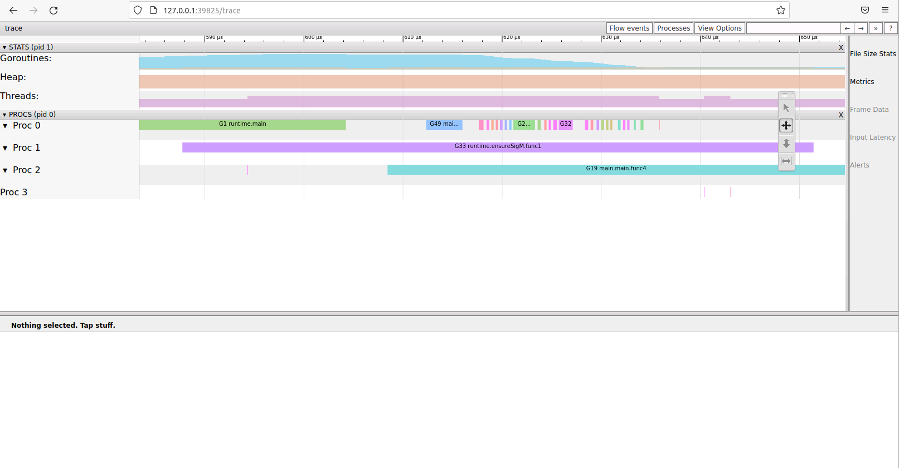
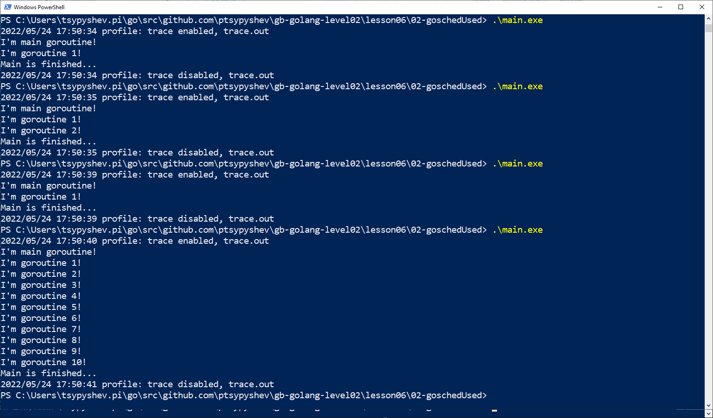
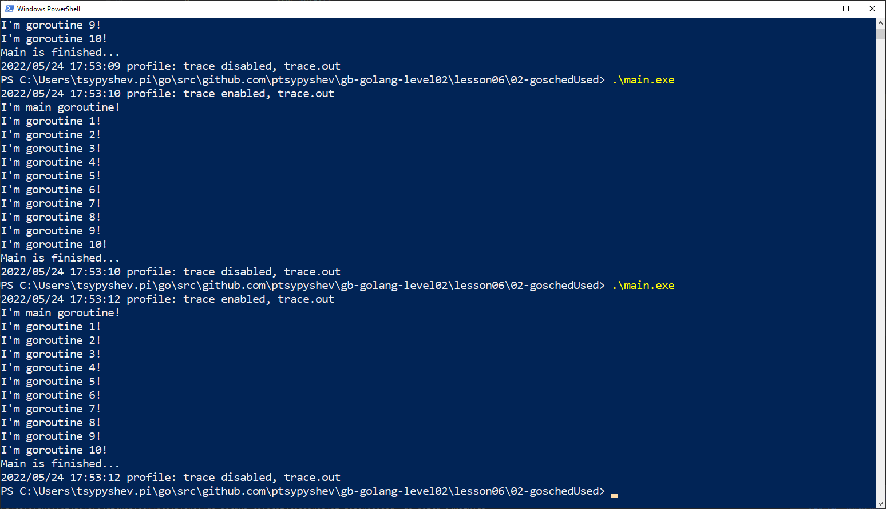

# ДЗ 06

##  1. Написать программу, которая использует мьютекс для безопасного доступа к данным из нескольких потоков. Выполните трассировку программы
Решение в директории 01-traceMutex.  
Создана структура safeMap, которая содержит мапу и RWMutex, реализующая безопасные методы чтения/записи в мапу.
```golang
type safeMap struct {
    m   map[int]string
    rwm *sync.RWMutex
}

func NewSafeMap() *safeMap {
    return &safeMap{
        m:   make(map[int]string),
        rwm: &sync.RWMutex{},
    }
}

func (sm safeMap) SetVal(val string) {
    sm.rwm.Lock()
    sm.m[len(sm.m)] = val
    sm.rwm.Unlock()
}

func (sm safeMap) GetVal(key int) (string, bool) {
    sm.rwm.RLock()
    val, ok := sm.m[key]
    sm.rwm.RUnlock()
    return val, ok
}

func (sm safeMap) PrintMap() {
    fmt.Println(sm.m)
}
```

В функции main используем функционал пакета profile для создания файла трассировки:    
```golang
defer profile.Start(profile.TraceProfile, profile.ProfilePath(".")).Stop()
```
  
Далее в цикле создаем горутины, которые заполняют мапу данными (буквы алфавита).
Собираем и запускаем программу, и смотрим результат трассировки:
```sh
$ go build main.go 
$ ./main 
2022/05/24 16:50:28 profile: trace enabled, trace.out
map[0:Z 1:M 2:N 3:O 4:P 5:Q 6:R 7:S 8:T 9:U 10:V 11:W 12:X 13:Y 14:F 15:A 16:B 17:C 18:D 19:E 20:I 21:G 22:H 23:J 24:K 25:L]
2022/05/24 16:50:28 profile: trace disabled, trace.out
$ go tool trace trace.out 
2022/05/24 16:50:40 Parsing trace...
2022/05/24 16:50:40 Splitting trace...
2022/05/24 16:50:40 Opening browser. Trace viewer is listening on http://127.0.0.1:39825
```
В проекте приложен скриншот (lesson06/screenshots/01-trace.png)


## 2. Написать многопоточную программу, в которой будет использоваться явный вызов планировщика. Выполните трассировку программы
Решение в директории 02-goschedUsed.  
Сначала ограничиваем количество доступных потоков ОС до 1 и используем функционал пакета profile.
```golang
runtime.GOMAXPROCS(1)
defer profile.Start(profile.TraceProfile, profile.ProfilePath(".")).Stop()
```

Далее в цикле создаются отдельные горутины, изменяющие значения счетчика. Далее в каждой горутине выводится сообщение со значением счетчика и запускается вечный цикл.
```golang
for i := 0; i < 10; i++ {
    go func() {
        m.Lock()
        goroutinesCounter++
        m.Unlock()
        fmt.Printf("I'm goroutine %d!\n", goroutinesCounter)
        for {
        
        }
    }()
}
```

Затем запускаем цикл, который может вызвать планировщик, для запуска ожидающих горутин (runtime.Gosched):
```golang
for i := 0; ; i++ {
    if i%1e5 == 0 {
        fmt.Println("I'm main goroutine!")
        runtime.Gosched()
	}
    if i%1e8 == 0 {
        time.Sleep(time.Millisecond)
        fmt.Println("Main is finished...")
        return
    }
}
```

Собираем и запускаем программу, и смотрим результат трассировки (без Gosched):
```sh
$ go build main.go 
$ ./main 
2022/05/24 17:51:23 profile: trace enabled, trace.out
I\'m main goroutine!
Main is finished...
2022/05/24 17:51:23 profile: trace disabled, trace.out
$ go tool trace trace.out 
2022/05/24 17:51:40 Parsing trace...
2022/05/24 17:51:40 Splitting trace...
2022/05/24 17:51:40 Opening browser. Trace viewer is listening on http://127.0.0.1:38224
```

Та же программа, но с Gosched:  
```sh
2022/05/24 17:55:58 profile: trace enabled, trace.out
I\'m main goroutine!
I\'m goroutine 1!
I\'m goroutine 2!
I\'m goroutine 3!
I\'m goroutine 4!
I\'m goroutine 5!
I\'m goroutine 6!
I\'m goroutine 7!
I\'m goroutine 8!
I\'m goroutine 9!
I\'m goroutine 10!
Main is finished...
2022/05/24 17:55:58 profile: trace disabled, trace.out
```

При этом поведение на Windows отличается - иногда без запуска runtime.Gosched() успевают отработать все горутины, иногда частично.
В проекте приложены скриншоты:  
(lesson06/screenshots/02-output_without_gosched.png) - без Gosched 

и (lesson06/screenshots/02-output_with_gosched.png) - с Gosched


Файлы с результатами трассировки также приложены.

## 3. Смоделировать ситуацию “гонки”, и проверить программу на наличии “гонки”
Решение в директории 03-raceCondition.  

Используем программу из 4-го урока, которая использует небезопасную запись в общую для горутин память.
Запускаем проверку на состояние гонки:  
```sh
$ go run -race main.go 
==================
WARNING: DATA RACE
Read at 0x00c0000be008 by goroutine 8:
  main.main.func1()
      /home/pavel/go/src/gb-golang-level02/lesson06/03-raceCondition/main.go:28 +0x74
  main.main.func2()
      /home/pavel/go/src/gb-golang-level02/lesson06/03-raceCondition/main.go:30 +0x47

Previous write at 0x00c0000be008 by goroutine 7:
  main.main.func1()
      /home/pavel/go/src/gb-golang-level02/lesson06/03-raceCondition/main.go:28 +0x86
  main.main.func2()
      /home/pavel/go/src/gb-golang-level02/lesson06/03-raceCondition/main.go:30 +0x47

Goroutine 8 (running) created at:
  main.main()
      /home/pavel/go/src/gb-golang-level02/lesson06/03-raceCondition/main.go:22 +0x97

Goroutine 7 (finished) created at:
  main.main()
      /home/pavel/go/src/gb-golang-level02/lesson06/03-raceCondition/main.go:22 +0x97
==================
I\'ve counted 999 goroutines.
Found 1 data race(s)
exit status 66
```
Далее исправляем поведение программы (раскомментируем строки использующие функционал sync)
Запускаем проверку на состояние гонки ещё раз:
```sh
$ go run -race main.go 
I\'ve counted 1000 goroutines.
```
Предупреждение не выводится.